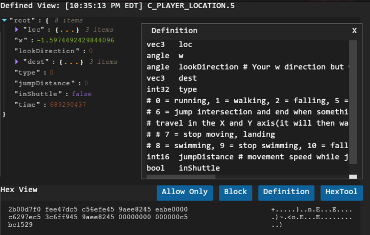

# Packet Logger

>Dependencies: [tera-proxy](https://github.com/tera-proxy/tera-proxy) or [toolbox](https://github.com/tera-toolbox/tera-toolbox), [UI](https://github.com/tera-mods/ui)

This is a gui packet logger for tera-proxy/toolbox that allows you to see TERA's live network stream.

The mod uses the tera-data def library and tera-data-parser to parse packets into a "human readable" format

## Usage

| Command | Description |
| --- | --- |
| logger | opens the packet logger UI |


## Features

- Packet log
- Packet definition parsing
- Log Filtering
- Saving and loading of filters and packet logs

### Definition reference

Clicking the defintion button while a packet is selected will open up the definition used to parse that packet.

This window is draggable and resizeable(resize from the bottom right corner)



### Hex Tool

This tool will is a quick calucator for converting the hex from packet data. All of the conversions are little endien and the string format is UCS2 like the tera protocol.


## Contributing

Feel free to submit issues and PRs to improve the tool/fix bugs. The UI uses React and the unbuit app is in `/src` just run `npm i` to install the dependencies and `npm start` to start the dev enviorment.

You'll need to be sure it can connect to the api too. Either start tera-proxy and load the mod then use the server running there or reconfigure it to run standalone.

To build the UI run `npm run build`

---

## Change Log

```none
5/31/20
- Added support for toolbox
8/24/20
- Alphabetized filters
- Configurable max log size
- Log save format is much better (data is serialized)
- Definition window now displays more data about the packet
    ○ Timestamp
    ○ Name
    ○ Version
    ○ Modified (noted with a `*`)
    ○ Bad Def (if the def length doesn't match data recieved)
- Lots of backend optimization
- New collapsed view mode
- Unmapped packet handler (unmapped packets are notes with `*` in the log)
```
